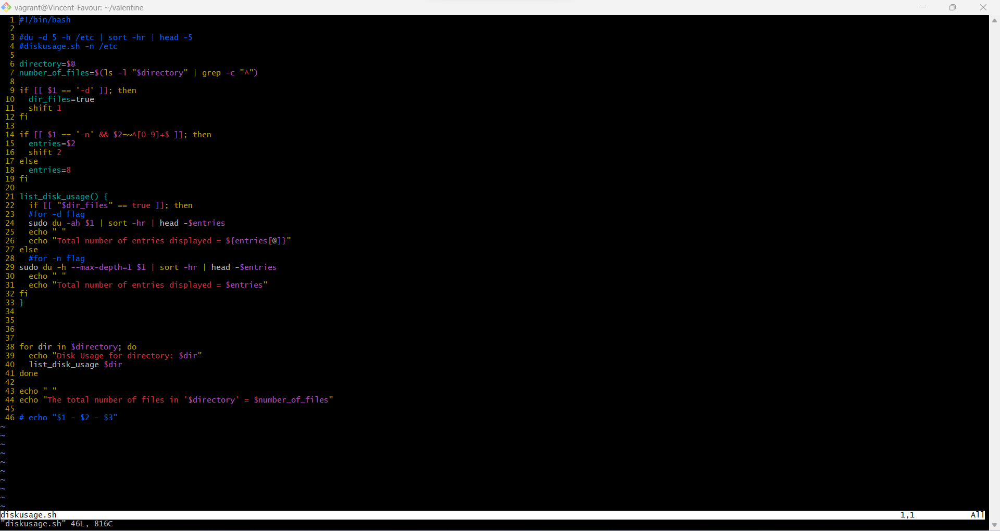
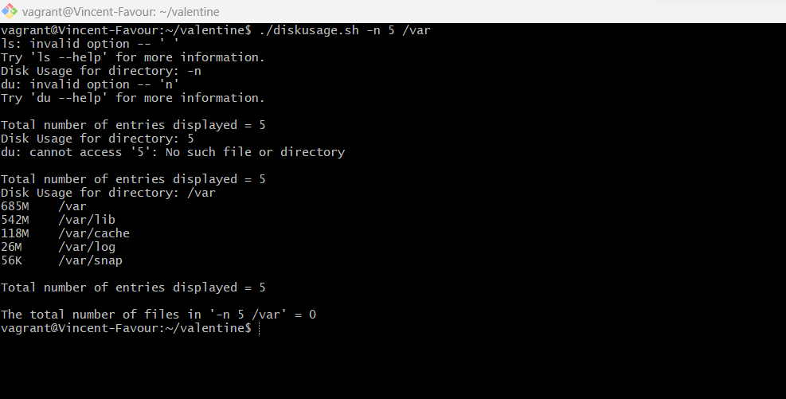
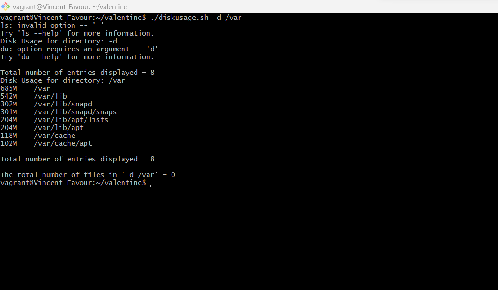
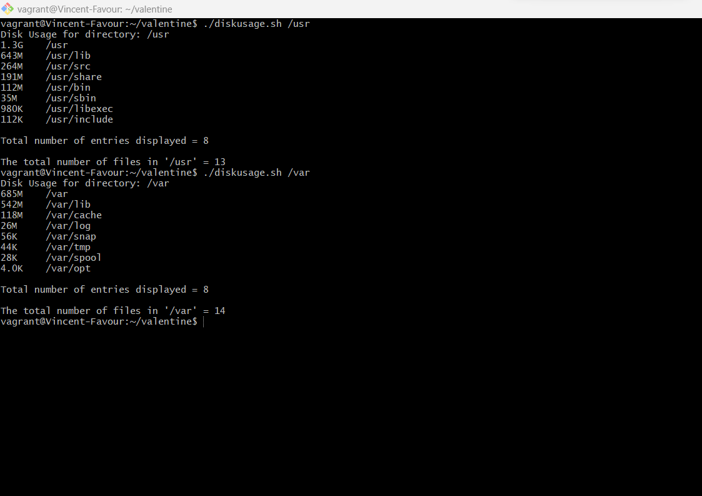
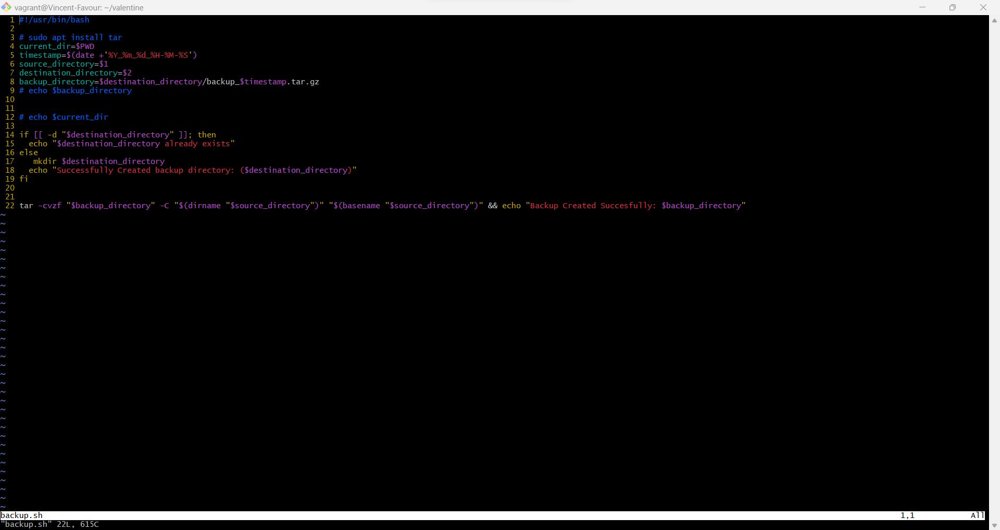
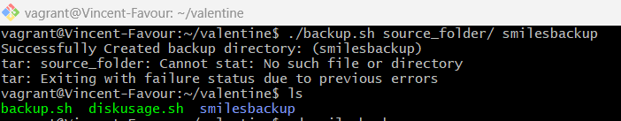
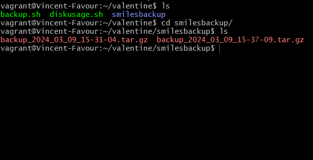

Write a shell script that checks the disk usage in a given directory.
the script can take two optional arguments and one compulsory argument...
-d: which means that all files and directory within the specified directory or directories should be listed.
-n: which means that the top N enteries should be returned.
list of directories: this will be the directories you want to check it's disk usage

*script for diskusage*

eg yourscript.sh -n 5 /var
should return the top 5 directories wrt disk usage in /var directory

*result of dickusage.sh -n 5 /var*

yourscript.sh -d /var
should list both directories and files

*result of dickusage.sh -d /var*

Note: if -n argument is not given, it should return 8 enteries by default.

*result of dickusage.sh /var*

**Create a backup script. This script creates a backup of a given directory and saves it in another directory with a timestamp. It takes two arguments:
the source directory and the destination directory**

*script for diskusage*

*result of backup.sh*

**Note: The backup should be a tar archive**

*result of backup.sh*